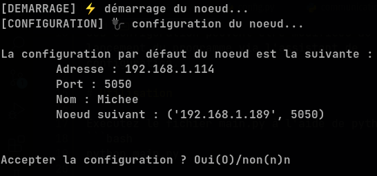

# Configuration

Le fichier de configuration contient deux sections : _local_ et _voisin_.
- local : permet de définir certains paramètres pour le noeud. Ces paramètres sont les suivants :
  - Port : le port sur lequel le noeud doit écouter les messages.
  - Nom : le nom du noeud. Il permet de rendre les messages plus lisibles au lieu d'utiliser l'uuid des noeuds.
- voisin : ce sont les paramètres du noeud voisin. On y retrouve les paramètres suivants :
  - IP : l'adresse IP du noeud voisin
  - Port : le port sur lequel envoyer les messages

Le module config.py contient des fonctions qui permettent de récupérer les valeurs par défaut des différents paramètres.

Ces configuration peuvent être modifiées au lancement du programme via l'assistant de configuration.

# Utilisation

Exécutez le fichier main.py à l'aide de python :
```bash
python main.py
```
Le programme se lance alors sur l'assisant de configuration :



Vous aurez alors la possibilité de changer les différents paramètres affichés à l'exception de l'ip du noeud actuel.

Après la validation de la configuration. On vous demandera si oui ou non vous souhaiteriez lancer l'élection maintenant.
Pour cette implémentation. Vous devez répondre non sur tous les noeuds conectés à l'exception d'un seul, c'est ce noeud qui lancera l'élection.

# L'algorithme

L'algorithme de Chang et Robert est un algorithme d'élection pour les systèmes distribués. Vous trouverez plus d'informations au lien [suivant](https://en.wikipedia.org/wiki/Chang_and_Roberts_algorithm).